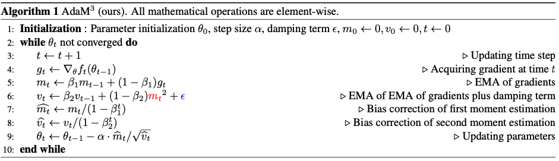

# AdaM$^3$ experiments

This repo provides the code for submission "Momentum is All You Need for Adaptive Optimization". 


## Usage


To reproduce the results of the CNN on CIFAR-10 experiments,

```
cd CNN_CIFAR
```

To reproduce the results of the CNN on ImageNet experiments,

```
cd CNN_ImageNet
```

To reproduce the results of the LSTM on Penn Treebank experiments,

```
cd LSTM_Penn_Treebank
```

To reproduce the results of the Transformer for Neural Machine Translation experiments,

```
cd Transformer_NMT
```

To reproduce the results of the SNGAN on CIFAR-10 experiments,

```
cd SNGAN
```

To reproduce the results of the DCGAN and BigGAN on CIFAR-10 experiments,

```
cd DCGAN_BigGAN
```


