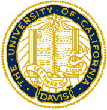
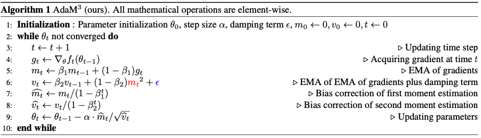

# Momentum is All You Need for Data-Driven Adaptive Optimization（ICDM 2023）


<div align="left">
    <a></a>
    <a></a>
    <a></a>
    <a></a>
</div>

 [arXiv (previous version, will be updated soon)](https://arxiv.org/pdf/2106.11514.pdf) | Primary contact: [Yizhou Wang](mailto:wyzjack990122@gmail.com)

<div align="center">
  
</div>


## Abstract

Adaptive gradient methods, e.g., Adam, have achieved tremendous success in data-driven machine learning, especially deep learning. Employing adaptive learning rates according to the gradients, such methods are able to attain rapid training of modern deep neural networks. Nevertheless, they are observed to suffer from compromised generalization capacity compared with stochastic gradient descent (SGD) and tend to be trapped in local minima at an early stage during the training process. Intriguingly, we discover that the issue can be resolved by substituting the gradient in the second raw moment estimate term with its exponential moving average version in Adam. The intuition is that the gradient with momentum contains more accurate directional information, and therefore its second-moment estimation is a more preferable option for learning rate scaling than that of the raw gradient. Thereby we propose AdaM$^3$ as a new optimizer reaching the goal of training quickly while generalizing much better. We further develop a theory to back up the improvement in generalization and provide novel convergence guarantees for our designed optimizer. Extensive experiments on a variety of tasks and models demonstrate that AdaM$^3$ exhibits state-of-the-art performance and superior training stability consistently. Considering the simplicity and effectiveness of AdaM$^3$, we believe it has the potential to become a new standard method in deep learning. 

## TODO
The AdaM$^3$ optimizer python package will be added soon. Stay tuned!

## Usage


To reproduce the results of the CNN on CIFAR-10 experiments,

```
cd CNN_CIFAR
```

To reproduce the results of the CNN on ImageNet experiments,

```
cd CNN_ImageNet
```

To reproduce the results of the LSTM on Penn Treebank experiments,

```
cd LSTM_Penn_Treebank
```

To reproduce the results of the Transformer for Neural Machine Translation experiments,

```
cd Transformer_NMT
```

To reproduce the results of the SNGAN on CIFAR-10 experiments,

```
cd SNGAN
```

To reproduce the results of the DCGAN and BigGAN on CIFAR-10 experiments,

```
cd DCGAN_BigGAN
```

## Acknowledgments
In this code, we heavily rely on the code of [AdaBelief](https://github.com/juntang-zhuang/Adabelief-Optimizer) and [AdaBound](https://github.com/Luolc/AdaBound). We also greatly thank the anounymous ICDM'23 reviewers for the constructive comments to help us improve the paper. 


## BibTeX

```BibTeX
@article{wang2021rethinking,
  title={Rethinking Adam: A twofold exponential moving average approach},
  author={Wang, Yizhou and Kang, Yue and Qin, Can and Wang, Huan and Xu, Yi and Zhang, Yulun and Fu, Yun},
  journal={arXiv preprint arXiv:2106.11514},
  year={2021}
}

```


